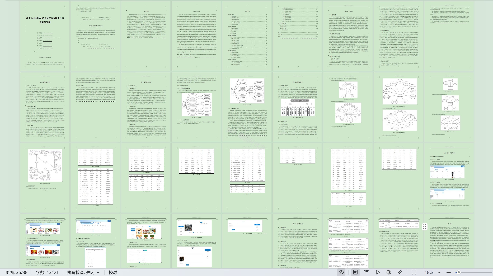

# springbootA523D
springbootA523D考研交流互助平台+LW+PPT
 
## 查看主页获取源码

### 一、关键词
考研资料管理、报考指南管理、科目管理

### 二、作品包含
源码+数据库+设计文档万字+ppt+全套环境和工具资源+部署教程

### 三、项目技术
前端技术：Html、Css、Js、Vue3.0、Element-ui 
后端技术：Java、SpringBoot3.0、MyBatis

### 四、运行环境（以下版本亲测，其他版本未知，请自测）
开发工具：IDEA/eclipse  + VSCODE

数据库：MySQL5.7（最低要5.7版本）

数据库管理工具：Navicat10以上版本

环境配置软件： JDK17 + Maven3.6.3

前端Nodejs：20

浏览器：谷歌浏览器

### 五、项目介绍
项目编号：springbootA523D

考研交流互助平台是供考研人交流备考经验、分享资料信息、互助解答疑问，助力共同备考的线上空间。

角色：管理员、用户

管理员：首页、用户管理、科目管理、报考指南管理、考研资料管理、订单管理、论坛管理、系统管理。

用户：首页、报考指南、论坛交流、购物车、考研资讯、考研资料、个人中心、修改密码、订单管理、我的发布、地址、我的收藏。

### 六、运行截图

